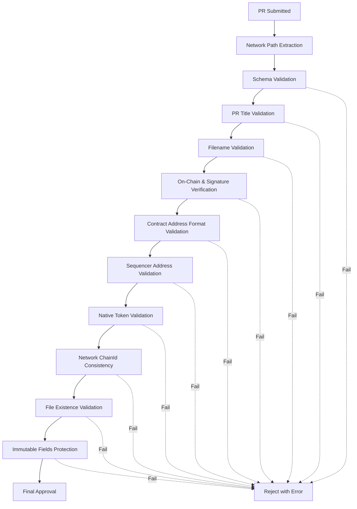

# Validation System

Comprehensive automated validation system ensuring metadata integrity and security for Tokamak rollup metadata repository.

## 🎯 Overview

The validation system provides multi-layered security through JSON schema validation, on-chain verification, cryptographic signature validation, and automated testing. All validation is performed automatically via GitHub Actions with comprehensive error reporting.

## 🔍 Validation Layers - 6계층 시스템

### Layer 1: Schema Validation
- **JSON Structure**: Validates against defined schema with required fields and data types
- **Format Rules**: Validates URLs, addresses, timestamps, and enum values
- **Field Completeness**: Ensures all mandatory fields are present and properly formatted

### Layer 2: On-Chain Verification
- **Contract Existence**: Verifies SystemConfig contract deployment on L1
- **SystemConfig Interaction**: Calls `SystemConfig.unsafeBlockSigner()` and `nativeTokenAddress()`
- **Sequencer Authority**: Validates sequencer address against on-chain data
- **Native Token Consistency**: Ensures ERC20 token addresses match on-chain configuration

### Layer 3: Cryptographic Verification
- **Signature Validation**: Verifies sequencer signatures using ethers.js
- **Message Format**: Confirms exact message format compliance with operation type
- **Signer Authority**: Ensures signatures come from authorized on-chain sequencers

### Layer 4: File Structure Validation
- **Filename Format**: Validates filename matches SystemConfig address (lowercase)
- **Directory Structure**: Ensures correct network directory path (`data/{network}/`)
- **PR Title Format**: Validates pull request naming conventions with operation type

### Layer 5: Operation-Based Validation
- **Operation Type Detection**: Differentiates register vs update operations from PR title
- **File State Consistency**: Validates file existence matches operation type
- **Cross-Validation**: Ensures signature message operation matches PR title operation

### Layer 6: Immutable Field Protection
- **Core Field Protection**: Prevents modification of chainId, SystemConfig, rollupType during updates
- **Data Integrity**: Maintains consistency across updates with detailed violation reporting
- **Staking Protection**: Protects registration transaction and candidate address data

## 🏗️ System Architecture

### Validation Pipeline



### Core Components

1. **Schema Validator** - JSON schema compliance checking
2. **On-Chain Verifier** - SystemConfig contract and sequencer validation
3. **Crypto Validator** - Signature verification with message format validation
4. **Business Logic Validator** - Repository-specific filename and path rules
5. **Operation Validator** - Register vs update operation logic
6. **Immutable Field Protector** - Update integrity enforcement

## 📋 Core Validation Components

### Schema Validation

**Implementation**: [`validators/rollup-validator.ts`](../validators/rollup-validator.ts#L323-L363)

```javascript
const rollupMetadataSchema = {
  type: 'object',
  required: [
    'chainId', 'name', 'description', 'rollupType', 'stack',
    'rpcUrl', 'nativeToken', 'status', 'createdAt', 'lastUpdated',
    'l1Contracts', 'l2Contracts', 'bridges', 'explorers',
    'sequencer', 'staking', 'networkConfig', 'metadata'
  ],
  properties: {
    chainId: { type: 'number', minimum: 1 },
    name: { type: 'string', minLength: 1 },
    rollupType: {
      type: 'string',
      enum: ['optimistic', 'zk', 'sovereign', 'validium']
    },
    rpcUrl: { type: 'string', format: 'uri' }
    // ... additional properties
  }
};
```

**Key Features:**
- Comprehensive JSON schema with 25+ required fields
- Address format validation with EIP-55 checksum support
- URL format validation for HTTP/HTTPS and WebSocket protocols
- Enum validation for rollup types and network configurations

### On-Chain Verification

**Implementation**: [`validators/rollup-validator.ts`](../validators/rollup-validator.ts#L484-L541)

**SystemConfig Validation:**
- Contract existence verification on L1 network
- `unsafeBlockSigner()` call to retrieve sequencer address
- Sequencer address comparison (on-chain vs metadata)
- RPC connectivity and comprehensive error handling

**Native Token Address Validation**: [`validators/rollup-validator.ts`](../validators/rollup-validator.ts#L961-L1000)
- Validates `SystemConfig.nativeTokenAddress()` matches `metadata.nativeToken.l1Address`
- ERC20 token specific validation (ETH tokens skipped)
- Ensures on-chain configuration consistency

### Signature Verification

**Implementation**: [`validators/rollup-validator.ts`](../validators/rollup-validator.ts#L543-L591)

**Message Format:**
```
Tokamak Rollup Registry
Chain ID: {chainId}
Operation: {operation}
SystemConfig: {systemConfigAddress}
```

**Validation Process:**
1. Verify on-chain sequencer address
2. Reconstruct message with correct operation type
3. Verify signature using `ethers.verifyMessage()`
4. Validate signer matches on-chain sequencer

### File Structure & Naming

**Implementation**: [`validators/rollup-validator.ts`](../validators/rollup-validator.ts#L371-L386)

**Validation Rules:**
- Filename must match SystemConfig address: `{address}.json` (lowercase)
- Network extraction from path: `/data/{network}/`
- Case-insensitive address matching with proper normalization
- Directory structure validation for supported networks

**Network-ChainId Consistency**: [`validators/rollup-validator.ts`](../validators/rollup-validator.ts#L388-L430)
- Mainnet directory rejects known testnet chainIds
- Sepolia directory rejects known mainnet chainIds
- Proper L2 chainId categorization by network type

### Operation-Based Validation

**PR Title Parsing**: [`validators/rollup-validator.ts`](../validators/rollup-validator.ts#L432-L483)

**Required Format:**
- `[Rollup] network 0x1234...abcd - L2 Name` (new rollups)
- `[Update] network 0x1234...abcd - L2 Name` (existing rollups)

**File Existence Logic**: [`validators/rollup-validator.ts`](../validators/rollup-validator.ts#L727-L750)
- **Register operations**: File must NOT exist (prevents overwriting)
- **Update operations**: File must exist (validates existing rollup)
- Clear error messages with suggested operation type

### Immutable Field Protection

**Implementation**: [`validators/rollup-validator.ts`](../validators/rollup-validator.ts#L752-L817)

**Protected Fields:**
- `chainId` - Chain ID
- `l1Contracts.systemConfig` - SystemConfig address
- `rollupType` - Rollup type (optimistic, zk, etc.)
- `stack.name` - Stack name
- `createdAt` - Creation timestamp
- `staking.registrationTxHash` - Registration transaction hash
- `staking.candidateAddress` - Candidate address

**Features:**
- Compares existing file with new metadata using nested object access
- Prevents modification of core rollup properties during updates
- Special validation for staking registration fields
- Detailed error messages for each violation with recovery guidance

## 🧪 Automated Testing & CI/CD

### Complete Validation Pipeline

**Main Orchestration**: [`validators/rollup-validator.ts`](../validators/rollup-validator.ts#L593-L730)

**11-Step Validation Sequence:**
1. Network path extraction and validation
2. JSON schema validation
3. PR title parsing and validation
4. Filename format validation
5. On-chain sequencer verification
6. Signature verification with message validation
7. Contract address format validation
8. Sequencer address format validation
9. Network-chainId consistency validation
10. Operation-based file existence validation
11. Immutable fields protection (updates only)

**Features:**
- Operation-aware validation (register vs update)
- Detailed error collection and reporting
- Early termination on critical failures
- Comprehensive logging and debugging information

### GitHub Actions Workflow

**Implementation**: [`.github/workflows/validate-rollup-metadata.yml`](../.github/workflows/validate-rollup-metadata.yml)

**Automated Features:**
- PR-triggered validation on metadata file changes
- Multi-step validation process with proper error reporting
- Environment variable support for custom RPC URLs
- Comprehensive test execution (unit + integration)
- Parallel validation for improved performance

### CLI Validation Tools

```bash
# Complete validation with all steps
npm run validate data/sepolia/0x1234567890123456789012345678901234567890.json

# Individual validation components
npm run validate:schema data/sepolia/0x1234567890123456789012345678901234567890.json
npm run validate:onchain data/sepolia/0x1234567890123456789012345678901234567890.json
npm run validate:signature data/sepolia/0x1234567890123456789012345678901234567890.json

# With PR title validation
npm run validate --pr-title "[Rollup] sepolia 0x1234567890123456789012345678901234567890 - My L2" data/sepolia/0x1234567890123456789012345678901234567890.json

# Batch validation
npm run validate:all  # Validate all metadata files
```

## 🚨 Error Handling & Troubleshooting

### Common Validation Errors

**1. Schema Validation Errors**
- Missing required fields (`chainId`, `name`, `systemConfig`, etc.)
- Invalid data types (string instead of number, etc.)
- Format violations (invalid URLs, malformed addresses)
- Enum value violations (unsupported rollup types)

**2. On-Chain Validation Errors**
- SystemConfig contract not found at specified address
- Sequencer address mismatch (on-chain vs metadata)
- Native token address inconsistency for ERC20 tokens
- RPC connectivity issues or rate limiting

**3. Signature Validation Errors**
- Invalid signature format or encoding
- Signature verification failure with ethers.js
- Wrong signer address (not matching on-chain sequencer)
- Message format mismatch (incorrect operation type)

**4. File Structure Errors**
- Filename doesn't match SystemConfig address
- Wrong directory structure or network path
- PR title format violation
- Case sensitivity issues with addresses

**5. Operation-Based Validation Errors**
- Register operation attempted on existing file
- Update operation attempted on non-existent file
- PR title operation doesn't match signature message
- Invalid operation type in PR title

**6. Immutable Field Protection Errors**
- Attempt to change protected core fields during update
- Modification of staking registration details
- Creation timestamp alteration
- SystemConfig address change attempt

### Error Recovery Guidelines

**Operation-Based Issues:**
```
### How to Fix Operation Errors:

1. **Check file existence**: Verify if rollup already exists in repository
2. **Use correct operation**:
   - `[Rollup]` for new rollups (file must NOT exist)
   - `[Update]` for existing rollups (file must exist)
3. **Match PR title and signature**: Ensure operation type is consistent
4. **Verify address format**: SystemConfig address must match exactly

Example PR Titles:
- New: `[Rollup] sepolia 0x1234...abcd - My New L2`
- Update: `[Update] mainnet 0x5678...ef90 - Updated L2 Info`
```

**Immutable Field Protection:**
```
### Protected Fields (Cannot be changed):

Core Identity:
- chainId, l1Contracts.systemConfig, rollupType, stack.name

Timestamps:
- createdAt (creation timestamp)

Staking Data:
- staking.registrationTxHash, staking.candidateAddress

### Allowed Updates:
- description, status, lastUpdated
- URLs (website, explorer, bridge)
- Network configuration (gasLimit, blockTime)
- Contact and operational information
```

**Signature Issues:**
```
### Message Format Requirements:

Tokamak Rollup Registry
Chain ID: {chainId}
Operation: {register|update}
SystemConfig: {systemConfigAddress}

### Common Issues:
- Operation type mismatch between PR title and signature
- Wrong sequencer signing (must be on-chain sequencer)
- Message format deviation (extra spaces, different text)
```

## 🔗 Related Documentation

- **[Registration Guide](registration-guide.md)** - Step-by-step rollup registration process
- **[Metadata Schema](metadata-schema.md)** - Complete field specifications and examples
- **[File Naming](file-naming.md)** - Naming conventions and structure requirements
- **[Development Setup](development-setup.md)** - Local validation environment setup
- **[PR Process](pr-process.md)** - Pull request guidelines and operation types
- **[FAQ](faq.md)** - Common questions and troubleshooting tips