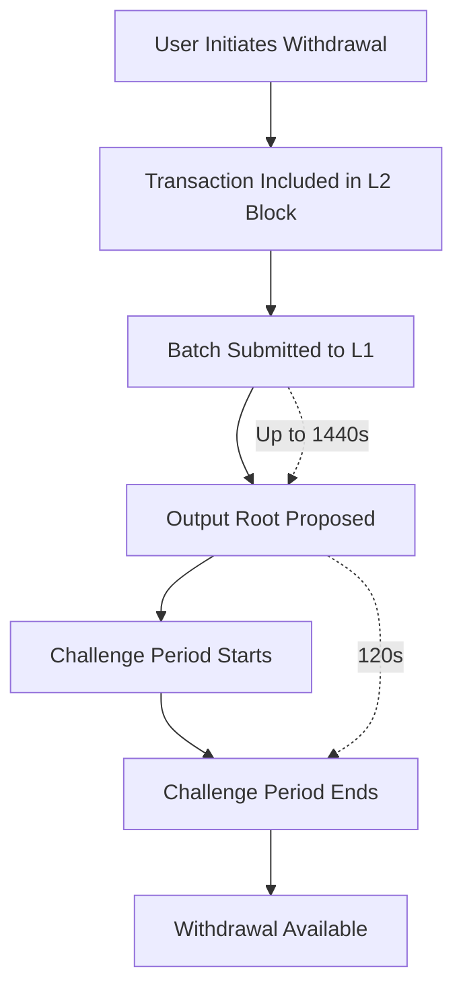
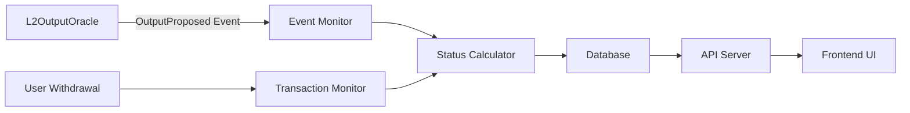

# Withdrawal Monitoring

A comprehensive guide for implementing withdrawal delay monitoring system for Tokamak rollups.

## 🎯 Overview

The withdrawal monitoring system tracks and calculates expected withdrawal completion times by monitoring L2OutputOracle events and providing real-time status updates to users.

## 📊 Withdrawal Timeline Understanding

### Key Parameters

- **Batch Submission Frequency**: 1440 seconds (24 minutes)
- **Output Root Frequency**: 240 seconds (4 minutes)
- **Challenge Period**: 120 seconds (2 minutes)
- **Expected Total Delay**: 1560 seconds (26 minutes)

### Calculation Formula

```javascript
expectedWithdrawalDelay = Math.max(batchSubmissionFrequency, outputRootFrequency) + challengePeriod
// Result: max(1440, 240) + 120 = 1560 seconds
```

### Timeline Phases



## 🏗️ Technical Architecture

### Core Components

1. **Event Monitor**: Tracks OutputProposed events from L2OutputOracle
2. **Status Calculator**: Computes withdrawal completion times
3. **Database**: Stores withdrawal requests and status updates
4. **API Server**: Provides real-time status to frontend
5. **Notification Service**: Sends alerts when withdrawals are ready

### Data Flow



## 🛠️ Implementation Guide

### 1. Environment Setup

Configure withdrawal monitoring parameters in metadata:

```json
{
  "withdrawalConfig": {
    "challengePeriod": 120,
    "expectedWithdrawalDelay": 1560,
    "monitoringInfo": {
      "l2OutputOracleAddress": "0x1234567890123456789012345678901234567890",
      "outputProposedEventTopic": "0x4ee37ac2c786ec85e87592d3c5c8a1dd66f8496dda3f125d9ea8ca5f657629b6"
    },
    "supportResources": {
      "statusPageUrl": "https://status.my-l2.com",
      "supportContactUrl": "https://support.my-l2.com",
      "explorerWithdrawalGuideUrl": "https://docs.my-l2.com/withdrawals"
    }
  },
  "networkConfig": {
    "batchSubmissionFrequency": 1440,
    "outputRootFrequency": 240
  }
}
```

### 2. Event Monitoring Service

#### Contract Setup

```javascript
const ethers = require('ethers');

// L2OutputOracle contract setup
const l2OutputOracleABI = [
  "event OutputProposed(bytes32 indexed outputRoot, uint256 indexed l2OutputIndex, uint256 indexed l2BlockNumber, uint256 l1Timestamp)"
];

const provider = new ethers.providers.JsonRpcProvider(L1_RPC_URL);
const l2OutputOracle = new ethers.Contract(
  rollupMetadata.withdrawalConfig.monitoringInfo.l2OutputOracleAddress,
  l2OutputOracleABI,
  provider
);
```

#### Event Listener Implementation

```javascript
class WithdrawalMonitor {
  constructor(rollupMetadata) {
    this.metadata = rollupMetadata;
    this.contract = new ethers.Contract(
      rollupMetadata.withdrawalConfig.monitoringInfo.l2OutputOracleAddress,
      l2OutputOracleABI,
      provider
    );
  }

  async startMonitoring() {
    // Listen for new OutputProposed events
    this.contract.on('OutputProposed', async (outputRoot, l2OutputIndex, l2BlockNumber, l1Timestamp, event) => {
      await this.handleOutputProposed({
        outputRoot,
        l2OutputIndex: l2OutputIndex.toNumber(),
        l2BlockNumber: l2BlockNumber.toNumber(),
        l1Timestamp: l1Timestamp.toNumber(),
        transactionHash: event.transactionHash,
        blockNumber: event.blockNumber
      });
    });

    // Monitor existing withdrawal requests
    setInterval(() => {
      this.updateWithdrawalStatuses();
    }, 30000); // Check every 30 seconds
  }

  async handleOutputProposed(eventData) {
    console.log('New output proposed:', eventData);

    // Update pending withdrawals that can now proceed
    await this.updateAffectedWithdrawals(eventData.l2BlockNumber);

    // Store output proposal for reference
    await this.storeOutputProposal(eventData);
  }
}
```

### 3. Withdrawal Status Calculator

#### Status Determination Logic

```javascript
class WithdrawalStatusCalculator {
  constructor(rollupMetadata) {
    this.challengePeriod = rollupMetadata.withdrawalConfig.challengePeriod;
    this.batchFrequency = rollupMetadata.networkConfig.batchSubmissionFrequency;
    this.outputFrequency = rollupMetadata.networkConfig.outputRootFrequency;
  }

  calculateWithdrawalStatus(withdrawal) {
    const now = Math.floor(Date.now() / 1000);

    // Check if output root includes this withdrawal
    const relevantOutput = this.findRelevantOutput(withdrawal.l2BlockNumber);

    if (!relevantOutput) {
      return {
        status: 'waiting_for_output',
        estimatedReadyTime: this.estimateOutputTime(withdrawal.l2BlockNumber),
        message: 'Waiting for output root to be proposed'
      };
    }

    // Calculate challenge period end
    const challengeEndTime = relevantOutput.l1Timestamp + this.challengePeriod;

    if (now < challengeEndTime) {
      return {
        status: 'in_challenge_period',
        estimatedReadyTime: challengeEndTime,
        remainingTime: challengeEndTime - now,
        message: `Challenge period ends in ${this.formatDuration(challengeEndTime - now)}`
      };
    }

    return {
      status: 'ready',
      estimatedReadyTime: challengeEndTime,
      message: 'Withdrawal is ready to be completed'
    };
  }

  estimateOutputTime(l2BlockNumber) {
    // Logic to estimate when output root will be proposed
    // Based on current L2 block and submission frequency
    const currentL2Block = this.getCurrentL2Block();
    const blocksUntilSubmission = Math.ceil((l2BlockNumber - currentL2Block) / this.getBlocksPerBatch());

    return Math.floor(Date.now() / 1000) + (blocksUntilSubmission * this.batchFrequency);
  }

  formatDuration(seconds) {
    const hours = Math.floor(seconds / 3600);
    const minutes = Math.floor((seconds % 3600) / 60);

    if (hours > 0) {
      return `${hours}h ${minutes}m`;
    }
    return `${minutes}m`;
  }
}
```

### 4. API Server Implementation

#### Express.js Endpoints

```javascript
const express = require('express');
const app = express();

// Get withdrawal status by transaction hash
app.get('/api/withdrawal/:txHash', async (req, res) => {
  try {
    const { txHash } = req.params;
    const withdrawal = await db.getWithdrawal(txHash);

    if (!withdrawal) {
      return res.status(404).json({ error: 'Withdrawal not found' });
    }

    const calculator = new WithdrawalStatusCalculator(rollupMetadata);
    const status = calculator.calculateWithdrawalStatus(withdrawal);

    res.json({
      withdrawal: {
        ...withdrawal,
        ...status
      }
    });
  } catch (error) {
    res.status(500).json({ error: error.message });
  }
});

// Get all pending withdrawals for an address
app.get('/api/withdrawals/:address', async (req, res) => {
  try {
    const { address } = req.params;
    const withdrawals = await db.getWithdrawalsByAddress(address);

    const calculator = new WithdrawalStatusCalculator(rollupMetadata);
    const withdrawalsWithStatus = withdrawals.map(w => ({
      ...w,
      ...calculator.calculateWithdrawalStatus(w)
    }));

    res.json({ withdrawals: withdrawalsWithStatus });
  } catch (error) {
    res.status(500).json({ error: error.message });
  }
});

// Webhook for new withdrawal transactions
app.post('/api/withdrawal/track', async (req, res) => {
  try {
    const { txHash, userAddress, amount, l2BlockNumber } = req.body;

    const withdrawal = {
      txHash,
      userAddress,
      amount,
      l2BlockNumber,
      createdAt: Math.floor(Date.now() / 1000),
      status: 'initiated'
    };

    await db.storeWithdrawal(withdrawal);

    res.json({ success: true, withdrawal });
  } catch (error) {
    res.status(500).json({ error: error.message });
  }
});
```

### 5. Frontend Integration

#### React Component Example

```jsx
import React, { useState, useEffect } from 'react';

const WithdrawalStatus = ({ txHash }) => {
  const [withdrawal, setWithdrawal] = useState(null);
  const [loading, setLoading] = useState(true);

  useEffect(() => {
    const fetchWithdrawalStatus = async () => {
      try {
        const response = await fetch(`/api/withdrawal/${txHash}`);
        const data = await response.json();
        setWithdrawal(data.withdrawal);
      } catch (error) {
        console.error('Error fetching withdrawal status:', error);
      } finally {
        setLoading(false);
      }
    };

    fetchWithdrawalStatus();

    // Poll for updates every 30 seconds
    const interval = setInterval(fetchWithdrawalStatus, 30000);
    return () => clearInterval(interval);
  }, [txHash]);

  if (loading) return <div>Loading withdrawal status...</div>;
  if (!withdrawal) return <div>Withdrawal not found</div>;

  const getStatusColor = (status) => {
    switch (status) {
      case 'ready': return 'green';
      case 'in_challenge_period': return 'orange';
      case 'waiting_for_output': return 'blue';
      default: return 'gray';
    }
  };

  const formatTimestamp = (timestamp) => {
    return new Date(timestamp * 1000).toLocaleString();
  };

  return (
    <div className="withdrawal-status">
      <h3>Withdrawal Status</h3>

      <div className="status-info">
        <div className={`status-badge ${getStatusColor(withdrawal.status)}`}>
          {withdrawal.status.replace('_', ' ').toUpperCase()}
        </div>

        <p>{withdrawal.message}</p>

        {withdrawal.estimatedReadyTime && (
          <p>
            <strong>Estimated Ready Time:</strong>
            {formatTimestamp(withdrawal.estimatedReadyTime)}
          </p>
        )}

        {withdrawal.remainingTime && (
          <p>
            <strong>Time Remaining:</strong>
            {Math.floor(withdrawal.remainingTime / 60)} minutes
          </p>
        )}
      </div>

      <div className="withdrawal-details">
        <p><strong>Transaction Hash:</strong> {withdrawal.txHash}</p>
        <p><strong>Amount:</strong> {withdrawal.amount} ETH</p>
        <p><strong>L2 Block Number:</strong> {withdrawal.l2BlockNumber}</p>
      </div>

      <div className="progress-bar">
        <div
          className="progress-fill"
          style={{
            width: `${getProgressPercentage(withdrawal)}%`,
            backgroundColor: getStatusColor(withdrawal.status)
          }}
        />
      </div>
    </div>
  );
};

const getProgressPercentage = (withdrawal) => {
  switch (withdrawal.status) {
    case 'waiting_for_output': return 25;
    case 'in_challenge_period': return 75;
    case 'ready': return 100;
    default: return 0;
  }
};

export default WithdrawalStatus;
```

### 6. Database Schema

#### PostgreSQL Tables

```sql
-- Withdrawal requests table
CREATE TABLE withdrawals (
  id SERIAL PRIMARY KEY,
  tx_hash VARCHAR(66) UNIQUE NOT NULL,
  user_address VARCHAR(42) NOT NULL,
  amount DECIMAL(36, 18) NOT NULL,
  l2_block_number BIGINT NOT NULL,
  status VARCHAR(50) NOT NULL DEFAULT 'initiated',
  created_at TIMESTAMP DEFAULT CURRENT_TIMESTAMP,
  updated_at TIMESTAMP DEFAULT CURRENT_TIMESTAMP
);

-- Output proposals table
CREATE TABLE output_proposals (
  id SERIAL PRIMARY KEY,
  output_root VARCHAR(66) NOT NULL,
  l2_output_index BIGINT NOT NULL,
  l2_block_number BIGINT NOT NULL,
  l1_timestamp BIGINT NOT NULL,
  l1_transaction_hash VARCHAR(66) NOT NULL,
  l1_block_number BIGINT NOT NULL,
  created_at TIMESTAMP DEFAULT CURRENT_TIMESTAMP
);

-- Indexes for performance
CREATE INDEX idx_withdrawals_user_address ON withdrawals(user_address);
CREATE INDEX idx_withdrawals_status ON withdrawals(status);
CREATE INDEX idx_output_proposals_l2_block ON output_proposals(l2_block_number);
```

## 📊 Monitoring and Analytics

### Key Metrics to Track

1. **Average Withdrawal Time**: Monitor actual completion times
2. **Challenge Success Rate**: Track if any challenges occur
3. **Output Proposal Frequency**: Verify submission schedule
4. **User Experience Metrics**: Time from initiation to completion

### Alerting System

```javascript
class WithdrawalAlerts {
  async checkDelayedOutputs() {
    const expectedInterval = this.metadata.networkConfig.outputRootFrequency;
    const lastOutput = await db.getLastOutputProposal();
    const timeSinceLastOutput = Date.now() / 1000 - lastOutput.l1Timestamp;

    if (timeSinceLastOutput > expectedInterval * 2) {
      await this.sendAlert('Output proposal delayed', {
        expected: expectedInterval,
        actual: timeSinceLastOutput
      });
    }
  }

  async notifyWithdrawalReady(withdrawal) {
    // Send notification to user that withdrawal is ready
    await this.sendNotification(withdrawal.userAddress, {
      type: 'withdrawal_ready',
      txHash: withdrawal.txHash,
      amount: withdrawal.amount
    });
  }
}
```

## 🔍 Testing and Validation

### Unit Tests

```javascript
describe('WithdrawalStatusCalculator', () => {
  test('calculates correct status for pending withdrawal', () => {
    const calculator = new WithdrawalStatusCalculator(mockMetadata);
    const withdrawal = {
      l2BlockNumber: 1000,
      createdAt: Math.floor(Date.now() / 1000) - 100
    };

    const status = calculator.calculateWithdrawalStatus(withdrawal);
    expect(status.status).toBe('waiting_for_output');
  });

  test('calculates remaining challenge time correctly', () => {
    const calculator = new WithdrawalStatusCalculator(mockMetadata);
    const withdrawal = {
      l2BlockNumber: 1000,
      outputProposal: {
        l1Timestamp: Math.floor(Date.now() / 1000) - 60 // 60s ago
      }
    };

    const status = calculator.calculateWithdrawalStatus(withdrawal);
    expect(status.remainingTime).toBe(60); // 120 - 60 = 60s remaining
  });
});
```

### Integration Tests

```javascript
describe('Withdrawal Monitoring Integration', () => {
  test('processes OutputProposed event correctly', async () => {
    const monitor = new WithdrawalMonitor(testMetadata);

    // Mock event
    const outputEvent = {
      outputRoot: '0x1234...',
      l2OutputIndex: 1,
      l2BlockNumber: 1000,
      l1Timestamp: Math.floor(Date.now() / 1000)
    };

    await monitor.handleOutputProposed(outputEvent);

    // Verify database updates
    const storedOutput = await db.getOutputProposalByIndex(1);
    expect(storedOutput.l2BlockNumber).toBe(1000);
  });
});
```

## 🚨 Error Handling and Edge Cases

### Common Issues and Solutions

1. **RPC Connection Failures**
   - Implement retry logic with exponential backoff
   - Use multiple RPC endpoints for redundancy

2. **Event Log Gaps**
   - Periodically sync historical events
   - Implement block range checks

3. **Challenge Period Variations**
   - Handle governance changes to challenge period
   - Update calculations dynamically

### Fallback Mechanisms

```javascript
class RobustWithdrawalMonitor extends WithdrawalMonitor {
  async handleRpcFailure() {
    // Switch to backup RPC
    this.provider = new ethers.providers.JsonRpcProvider(BACKUP_RPC_URL);
    this.contract = this.contract.connect(this.provider);
  }

  async syncMissedEvents(fromBlock, toBlock) {
    // Fetch events that might have been missed
    const events = await this.contract.queryFilter(
      this.contract.filters.OutputProposed(),
      fromBlock,
      toBlock
    );

    for (const event of events) {
      await this.handleOutputProposed(event.args);
    }
  }
}
```

## 🔗 Related Documentation

- [Metadata Schema](metadata-schema.md) - withdrawalConfig field details
- [Validation System](validation-system.md) - Automated validation of withdrawal settings
- [Registration Guide](registration-guide.md) - How to register withdrawal monitoring
- [FAQ](faq.md) - Common questions about withdrawal monitoring