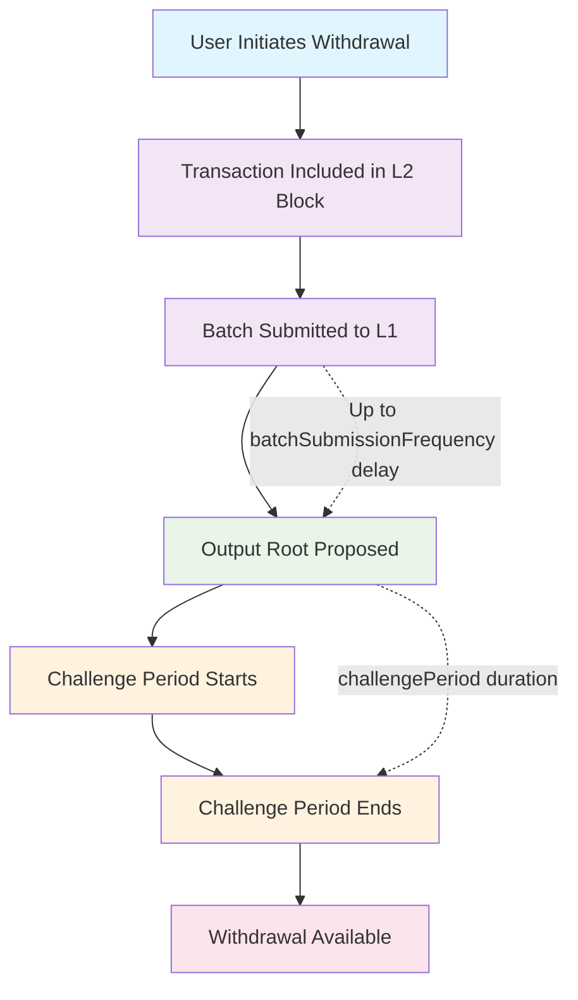

# Withdrawal Monitoring

A guide for implementing withdrawal delay monitoring for Tokamak rollups.

## Overview

The withdrawal monitoring system tracks withdrawal completion times by monitoring L2OutputOracle events and calculating expected delays based on rollup parameters.

## Core Monitoring Concepts

### Key Parameters to Monitor

Each L2 sequencer may have different values. Check your rollup's metadata for specific parameters:

- **Batch Submission Frequency**: Time between L2 batch submissions to L1
- **Output Root Frequency**: Time between output root proposals
- **Challenge Period**: Security delay before withdrawals can be finalized
- **Expected Withdrawal Delay**: Total time from withdrawal initiation to completion

### Withdrawal Time Calculation

```javascript
// Basic formula for withdrawal delay estimation
expectedWithdrawalDelay = Math.max(batchSubmissionFrequency, outputRootFrequency) + challengePeriod

// Example with typical values:
// max(1440, 240) + 12 = 1452 seconds (approximately 24 minutes)
```

### Monitoring Timeline Phases

The withdrawal process follows these sequential phases, each with specific timing constraints:

1. **Withdrawal Initiated**: User submits withdrawal transaction on L2
2. **Batch Inclusion**: Transaction included in L2 batch
3. **L1 Batch Submission**: Batch submitted to L1 (up to `batchSubmissionFrequency` delay)
4. **Output Root Proposal**: Output root proposed on L1 (up to `outputRootFrequency` delay)
5. **Challenge Period**: Security waiting period (`challengePeriod` duration)
6. **Withdrawal Ready**: User can complete withdrawal on L1

> **Note**: The actual timing may vary based on network conditions, gas prices, and sequencer behavior. The `batchSubmissionFrequency` and `outputRootFrequency` represent maximum delays.



### Timing Diagram

The following diagram shows a typical withdrawal timeline with realistic timing:

```mermaid
gantt
    title Withdrawal Timeline (Typical Values)
    dateFormat X
    axisFormat %s

    section L2 Processing
    Transaction Included    :done, t1, 0, 2
    Batch Submission       :done, t2, 2, 4

    section L1 Processing
    Output Root Proposed   :done, t3, 4, 6

    section Security
    Challenge Period       :active, t4, 6, 18

    section Completion
    Withdrawal Available   :milestone, t5, 18, 18
```



**Timing Breakdown:**
- **L2 Processing**: ~2-4 seconds (immediate block inclusion)
- **Batch Submission**: Up to `batchSubmissionFrequency` (typically 1440s = 24 minutes)
- **Output Root Proposal**: Up to `outputRootFrequency` (typically 240s = 4 minutes)
- **Challenge Period**: `challengePeriod` duration (typically 120s = 2 minutes)
- **Total Expected Delay**: `expectedWithdrawalDelay` (typically ~26 minutes)

## Essential Monitoring Methods

### 1. Event-Based Monitoring

Monitor the `OutputProposed` event from L2OutputOracle contract:

```solidity
event OutputProposed(
    bytes32 indexed outputRoot,
    uint256 indexed l2OutputIndex,
    uint256 indexed l2BlockNumber,
    uint256 l1Timestamp
)
```

### 2. Status Calculation Logic

```javascript
function calculateWithdrawalStatus(withdrawalL2Block, currentTime) {
    // Find relevant output root that includes this withdrawal
    const relevantOutput = findOutputForL2Block(withdrawalL2Block);

    if (!relevantOutput) {
        return {
            status: 'waiting_for_output',
            message: 'Waiting for output root proposal'
        };
    }

    const challengeEndTime = relevantOutput.l1Timestamp + challengePeriod;

    if (currentTime < challengeEndTime) {
        return {
            status: 'in_challenge_period',
            readyTime: challengeEndTime,
            remainingSeconds: challengeEndTime - currentTime
        };
    }

    return {
        status: 'ready',
        message: 'Withdrawal can be completed'
    };
}
```

### 3. Time Estimation Methods

```javascript
// Estimate when withdrawal will be ready (before output is proposed)
function estimateWithdrawalReadyTime(withdrawalTimestamp) {
    const maxBatchDelay = batchSubmissionFrequency;
    const maxOutputDelay = outputRootFrequency;
    const securityDelay = challengePeriod;

    return withdrawalTimestamp + Math.max(maxBatchDelay, maxOutputDelay) + securityDelay;
}

// Calculate precise ready time (after output is proposed)
function calculateExactReadyTime(outputL1Timestamp) {
    return outputL1Timestamp + challengePeriod;
}
```

## Data Requirements

### Rollup Metadata Structure

Your monitoring system needs access to these parameters from rollup metadata:

```json
{
  "withdrawalConfig": {
    "challengePeriod": 12,
    "monitoringInfo": {
      "l2OutputOracleAddress": "0x...",
      "outputProposedEventTopic": "0x..."
    },
    "batchSubmissionFrequency": 1440,
    "outputRootFrequency": 240
  }
}
```

**Key Parameters:**
- `challengePeriod`: Challenge period duration (seconds) - Security delay for dispute resolution
- `batchSubmissionFrequency`: Batch submission interval (seconds) - Maximum time between L2→L1 batch submissions
- `outputRootFrequency`: Output root submission interval (seconds) - Maximum time between output root proposals

**L2OutputOracle Contract Parameters:**
- `l2OutputOracleAddress`: L1-deployed L2OutputOracle contract address for monitoring output proposals
- `outputProposedEventTopic`: Event topic hash for filtering OutputProposed events (optional, uses standard Optimism Stack event if not specified)

### Required Contract Information

- **L2OutputOracle Address**: Contract address for monitoring output proposals
- **Event Topic Hash**: For filtering OutputProposed events
- **Challenge Period**: Duration in seconds
- **Batch/Output Frequencies**: For time estimation

## Implementation Considerations

### Real-time vs Polling

- **Event Subscription**: Real-time updates via WebSocket/subscription
- **Polling Method**: Periodic checks for new outputs and status updates
- **Hybrid Approach**: Events for new outputs + polling for status updates

### Status Categories

1. **waiting_for_output**: Withdrawal initiated but output not yet proposed
2. **in_challenge_period**: Output proposed, waiting for challenge period
3. **ready**: Challenge period complete, withdrawal can be finalized
4. **completed**: Withdrawal has been finalized on L1

## L2OutputOracle Contract

The **L2OutputOracle** contract is a critical component deployed on L1 that manages the withdrawal process for optimistic rollups. This contract serves as the bridge between L2 state and L1 verification.

### Contract Responsibilities

#### 1. Output Root Proposals
- **Purpose**: Proposes L2 block state roots to L1, making rollup state changes verifiable on L1
- **Function**: Acts as "snapshots" of L2 state at regular intervals
- **Security**: Ensures L2 state transitions are cryptographically verifiable on L1

#### 2. Challenge Period Management
- **Purpose**: Provides dispute period for proposed output roots
- **Security Mechanism**: Prevents malicious proposals through time-based security
- **State Management**: Keeps output roots in "pending" state during challenge period
- **Finalization**: Outputs become final after challenge period expires

#### 3. Event Emission
- **Event**: `OutputProposed` events when new output roots are proposed
- **Monitoring**: Enables withdrawal monitoring systems to track proposals
- **Timing**: Includes output root, L2 block number, and timestamp in events
- **Usage**: Calculates withdrawal readiness timing based on event data

### Contract Location and Deployment

- **Network**: L1 deployment (Ethereum mainnet, Sepolia, etc.)
- **Purpose**: L2→L1 output root management and withdrawal security
- **Relation**: Connected to `l1Contracts.L2OutputOracle` field in metadata
- **Address Consistency**: Must match `withdrawalConfig.monitoringInfo.l2OutputOracleAddress`

### Event System

#### OutputProposed Event
```solidity
event OutputProposed(
    bytes32 indexed outputRoot,
    uint256 indexed l2OutputIndex,
    uint256 indexed l2BlockNumber,
    uint256 l1Timestamp
)
```

#### Event Parameters
- `outputRoot`: Proposed L2 state hash (bytes32)
- `l2OutputIndex`: Sequential proposal index (uint256)
- `l2BlockNumber`: Corresponding L2 block number (uint256)
- `l1Timestamp`: Proposal timestamp on L1 (uint256)

#### Event Topic Details
- **Event Signature**: `"OutputProposed(bytes32,uint256,uint256,uint256)"`
- **Topic Hash**: `keccak256("OutputProposed(bytes32,uint256,uint256,uint256)")`
- **Standard Hash**: `0x4ee37ac2c786ec85e87592d3c5c8a1dd66f8496dda3f125d9ea8ca5f657629b6`
- **Usage**: Filters L1 logs for `OutputProposed` events to track output proposals

### Monitoring Integration

#### Event Filtering
```javascript
// Filter for OutputProposed events
const filter = {
    address: l2OutputOracleAddress,
    topics: [
        outputProposedEventTopic, // Standard topic hash
        null, // outputRoot (indexed)
        null, // l2OutputIndex (indexed)
        null  // l2BlockNumber (indexed)
    ]
};
```

#### Withdrawal Tracking
```javascript
// Track withdrawal readiness based on output proposals
function trackWithdrawalWithOutput(outputL1Timestamp, challengePeriod) {
    const readyTime = outputL1Timestamp + challengePeriod;
    return {
        outputProposedAt: outputL1Timestamp,
        challengeEndsAt: readyTime,
        isReady: Date.now() >= readyTime
    };
}
```

### Security Considerations

#### Challenge Period Purpose
- **Dispute Resolution**: Allows time for fraud proofs to be submitted
- **Malicious Prevention**: Prevents rapid malicious output proposals
- **Finality Assurance**: Ensures output roots are final after challenge period

#### Output Root Verification
- **Cryptographic Proof**: Each output root represents a verified L2 state
- **Sequential Ordering**: Outputs must be proposed in sequential order
- **Block Number Mapping**: Links L2 blocks to specific output proposals


### Error Handling

- Network connectivity issues
- RPC endpoint failures
- Contract call failures
- Event parsing errors

## Community Development Notes

- Values vary per L2 sequencer - always check specific rollup metadata
- Focus on withdrawal time calculation methods rather than full system implementation
- Community can build monitoring tools using these core concepts
- Actual delays may vary based on network conditions and gas prices